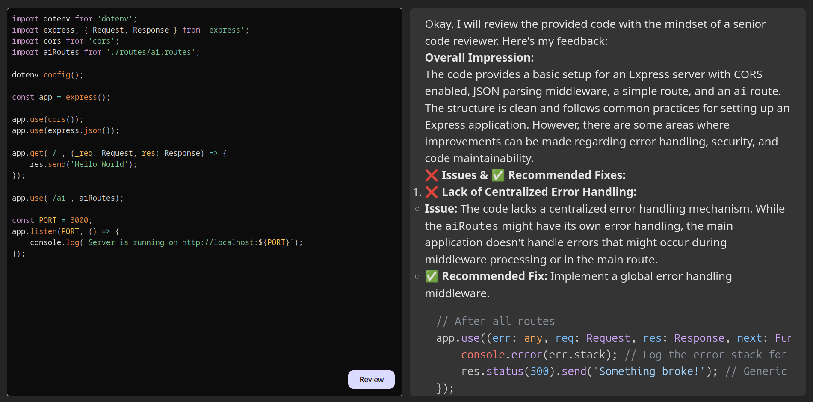

# Refacto
Refacto is a simple code review tool that helps developers improve their code quality. It analyses your code based on best practices, performance optimization, and security guidelines.

## Features
- ✅ Detects code issues and suggests improvements
- ✅ Ensures best coding practices and maintainability
- ✅ Identifies performance bottlenecks and security risks
- ✅ Provides structured and easy-to-follow feedback

## How It Works
- Paste your code into Refacto.
- The AI analyzes the code and provides feedback.
- Apply the suggested improvements to enhance code quality.